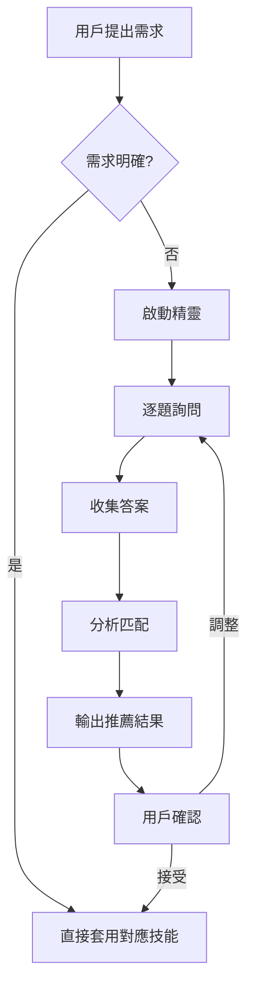

# 🧙 互動選擇精靈

## 精靈列表

| 精靈 | 用途 | 問題數 | 預計時間 |
|-----|------|--------|---------|
| [技術棧精靈](tech.md) | 選擇前後端框架、資料庫 | 12 題 | 5-10 分鐘 |
| [風格精靈](style.md) | 選擇設計風格、色彩、排版 | 15 題 | 5-10 分鐘 |
| [Coding Style 精靈](code.md) | 選擇程式碼規範、工具設定 | 15 題 | 5-10 分鐘 |

---

## 使用方式

### 對 AI 說：

**技術棧**：
- `幫我選擇技術棧`
- `我想建立網站，不知道該用什麼框架`
- `React 還是 Vue 比較適合我？`

**設計風格**：
- `幫我選擇設計風格`
- `我想要現代科技感的設計`
- `醫療網站適合什麼風格？`

**Coding Style**：
- `幫我選擇 coding style`
- `團隊專案該用什麼程式碼規範？`
- `ESLint 設定推薦`

---

## AI 執行流程



---

## 精靈回答格式

每個精靈完成後會輸出：

```
╔══════════════════════════════════════════════╗
║              ✨ 分析結果                      ║
╠══════════════════════════════════════════════╣
║ 🎯 推薦方案                                  ║
║    第一推薦：_______ (匹配度 __%)            ║
║    第二推薦：_______ (匹配度 __%)            ║
║    第三推薦：_______ (匹配度 __%)            ║
╠══════════════════════════════════════════════╣
║ 📝 推薦理由                                  ║
║    • 理由 1                                  ║
║    • 理由 2                                  ║
╠══════════════════════════════════════════════╣
║ ⚠️ 注意事項                                  ║
║    • 注意 1                                  ║
╠══════════════════════════════════════════════╣
║ 🔗 相關資源                                  ║
║    • 連結到對應的 Skill 文件                 ║
╚══════════════════════════════════════════════╝
```
